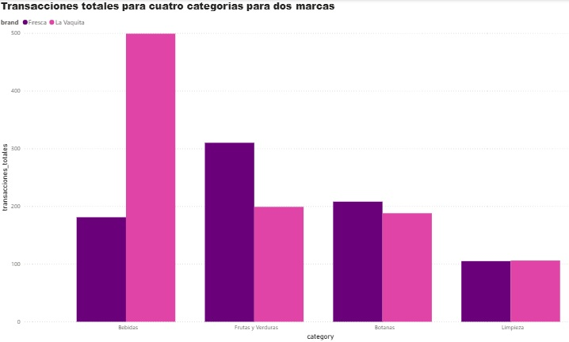
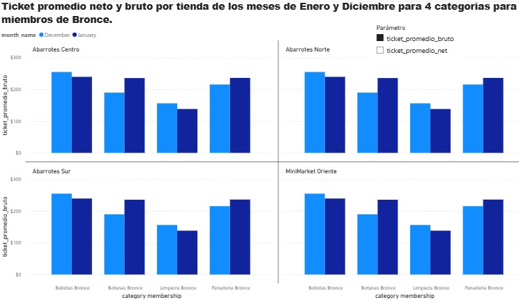
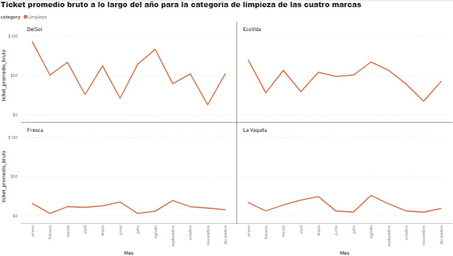

# Proyecto BI sobre tiendas de abarrotes en la Ciudad de México | Analisis de datos
Análisis de datos para negocio inteligente para una tiendas de abarrotes. 

# 🚔  | Analisis de datos 

## 📌 Objetivo del proyecto

Analizar datos de ventas en tiendas de abarrotes utilizando Power BI, obtener el promedio neto y bruto para la categoria de limpieza de las cuatro marcas según los datos, compararlas con otras categorias para identificar cual domina y proponer estrategias de atracción, visibilidad y/o impulso. Así mismo familiarizarse con el proceso ETL para poder extraer, validar, limpiar y transformar los datos con ayuda de Python y cargarlos a Power BI a traves de archivos CSV, por último reportar estos resultado a traves de un dashboard. 

## 🛠️ Tecnologías utilizadas

  

- Python
- Power BI
- Excel 
- Pandas  

---

## 🧱 Arquitectura del proyecto

  

---

## 🎥 Videos del proyecto

<table>
<tr>

<td align="center">

## 🎥 Explicación en Español

### 🇺🇸 English Version

</td>

</tr>
</table>

---

## 📊 Dashboard y visualizaciones

### Dashboard en Power BI

  
</a>

  
</a>

  
</a>

---

## 📂 Repositorio del proyecto

🔗 [Ver repositorio completo](https://github.com/EduardoGarcia12/An-lisis-de-datos-sobre-la-educaci-n-en-la-Alcald-a-Tlahuac-Ciudad-de-M-xico)

---

## ⚙️ Flujo de trabajo del pipeline

1. Generación de archivos XLSX con ayuda de Gemini. 
2. Limpieza, validación y transformación de datos utilizando Python con la libreria Pandas.
3. El proceso ETL nos genera un archivo CSV limpio para cada archivo XLSX de mis datos.
4. Implementacion del podelo estrella para poder tener un flujo de trabajo mas ordenado y poder crear calculos eficientemente. 
5. Visualización y análisis de los datos con Power BI.
---

## 📈 Resultados obtenidos

- Al obtener el ticker promedio bruto y neto, vemos que la categoria limpieza es la que tiene valores promedios muy bajos. 
- En funcion de lo anterior se grafica como este valor cambia a lo largo del año para poder cual o cuales marcas son las que tienen el ticke promedio bajo. 
- Para confirmar esto se hizo el conteo del tipo de transacciones y se grafico contra la categoria de la limpieza y las marcas respectivas y podemos afirmar que en efecto el ticket y transacciones para limpieza son las mas bajas. 
- Se proponen estrategias de atracción, visibilidad y de impulso. 

---

## 🧠 Qué aprendí

- Arquitectura basica para analizar datos. 
- Procesos ETL utilizando Python.
- Manejo de Power BI para organizar la información. 
- Diseño de dashboards para la toma de decisiones y propuestas de estrategias. 

---

## 🚀 Futuras mejoras

- Observar por trimestre y delimiar aun mas el problema. 
- Crear modelos predictivos sobre comportamiento de esta categoria para optimizar las ventas. 
- Escalar el proyecto simulado datos con Apache Kafka y ver la reaccion del modelo ante ciertos tipos de excepciones y/o errores. 
